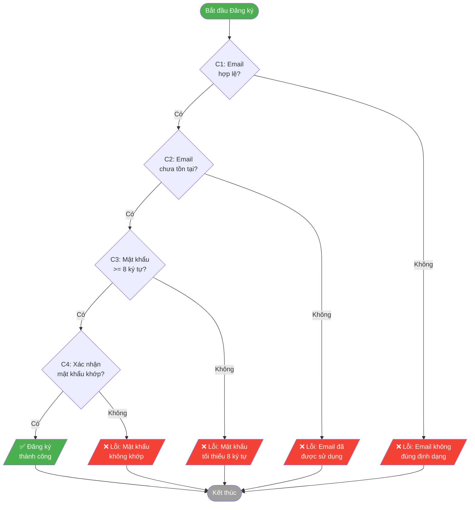
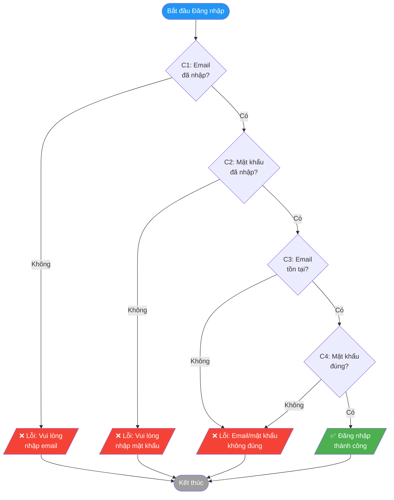
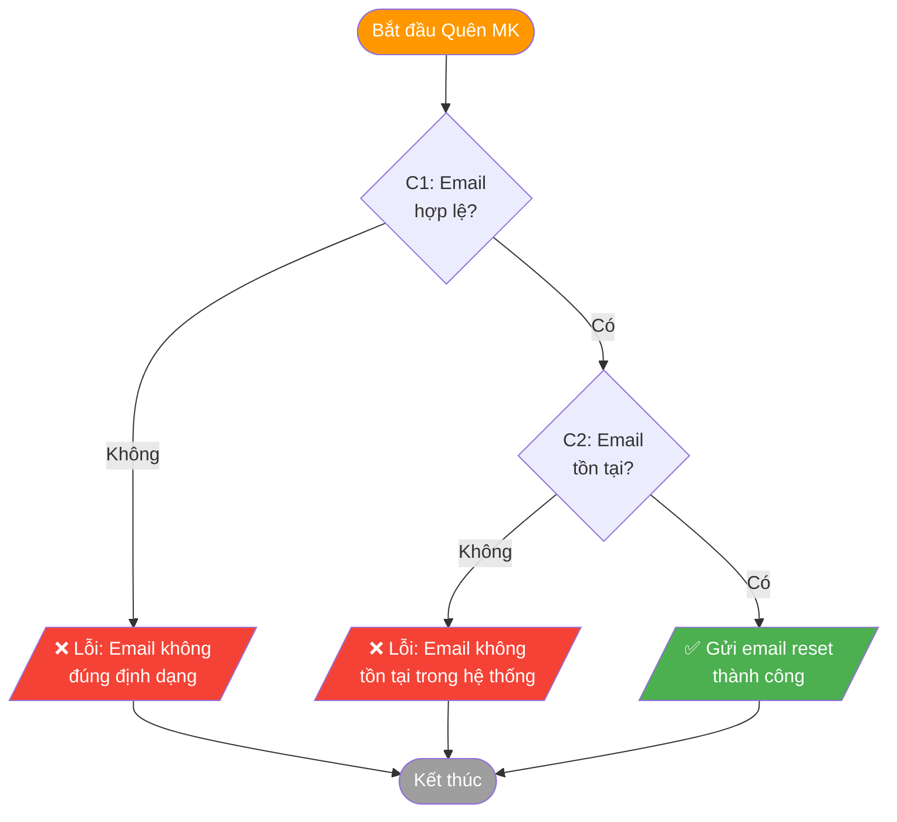
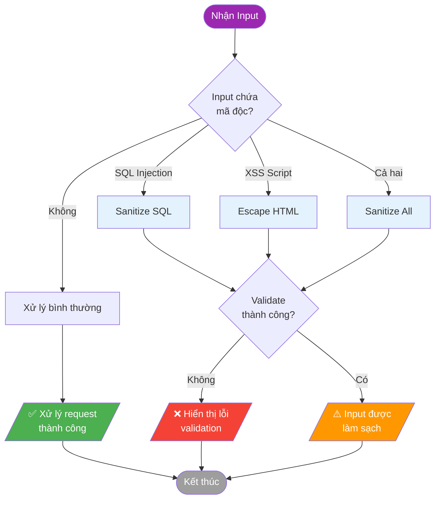

\# BẢNG QUYẾT ĐỊNH (DECISION TABLE)

## Mục đích

Bảng quyết định giúp xác định tất cả các kết hợp điều kiện đầu vào và kết quả tương ứng, đảm bảo coverage đầy đủ cho testing.

---

## 1. Bảng quyết định - Đăng ký (Registration)

### Biểu đồ luồng quyết định

### Điều kiện đầu vào

| Điều kiện | Mô tả |
|-----------|-------|
| C1 | Email hợp lệ (đúng định dạng) |
| C2 | Email chưa tồn tại trong hệ thống |
| C3 | Mật khẩu >= 8 ký tự |
| C4 | Mật khẩu xác nhận khớp |

### Bảng quyết định

| Rule | R1 | R2 | R3 | R4 | R5 | R6 | R7 | R8 |
|------|----|----|----|----|----|----|----|----|
| **Điều kiện** | | | | | | | | |
| C1: Email hợp lệ | T | T | T | T | T | T | F | F |
| C2: Email chưa tồn tại | T | T | T | T | F | F | - | - |
| C3: Mật khẩu >= 8 ký tự | T | T | F | F | - | - | - | - |
| C4: Xác nhận mật khẩu khớp | T | F | - | - | - | - | - | - |
| **Hành động** | | | | | | | | |
| Đăng ký thành công | ✓ | | | | | | | |
| Lỗi: "Mật khẩu không khớp" | | ✓ | | | | | | |
| Lỗi: "Mật khẩu tối thiểu 8 ký tự" | | | ✓ | ✓ | | | | |
| Lỗi: "Email đã được sử dụng" | | | | | ✓ | ✓ | | |
| Lỗi: "Email không đúng định dạng" | | | | | | | ✓ | ✓ |

### Mapping với Test Cases

| Rule | Test Case ID |
|------|--------------|
| R1 | TC_AUTH_001, TC_AUTH_005 |
| R2 | TC_AUTH_015 |
| R3, R4 | TC_AUTH_004 |
| R5, R6 | TC_AUTH_002 |
| R7, R8 | TC_AUTH_003 |

---

## 2. Bảng quyết định - Đăng nhập (Login)

### Biểu đồ luồng quyết định

### Điều kiện đầu vào

| Điều kiện | Mô tả |
|-----------|-------|
| C1 | Email đã nhập (không rỗng) |
| C2 | Mật khẩu đã nhập (không rỗng) |
| C3 | Email tồn tại trong hệ thống |
| C4 | Mật khẩu đúng |

### Bảng quyết định

| Rule | R1 | R2 | R3 | R4 | R5 | R6 |
|------|----|----|----|----|----|----|
| **Điều kiện** | | | | | | |
| C1: Email đã nhập | T | T | T | T | F | T |
| C2: Mật khẩu đã nhập | T | T | T | T | T | F |
| C3: Email tồn tại | T | T | F | F | - | - |
| C4: Mật khẩu đúng | T | F | - | - | - | - |
| **Hành động** | | | | | | |
| Đăng nhập thành công | ✓ | | | | | |
| Lỗi: "Email/mật khẩu không đúng" | | ✓ | ✓ | ✓ | | |
| Lỗi: "Vui lòng nhập email" | | | | | ✓ | |
| Lỗi: "Vui lòng nhập mật khẩu" | | | | | | ✓ |

### Mapping với Test Cases

| Rule | Test Case ID |
|------|--------------|
| R1 | TC_AUTH_006 |
| R2 | TC_AUTH_007 |
| R3, R4 | TC_AUTH_008 |
| R5 | TC_AUTH_009 |

---

## 3. Bảng quyết định - Quên mật khẩu (Forgot Password)

### Biểu đồ luồng quyết định

### Điều kiện đầu vào

| Điều kiện | Mô tả |
|-----------|-------|
| C1 | Email hợp lệ (đúng định dạng) |
| C2 | Email tồn tại trong hệ thống |

### Bảng quyết định

| Rule | R1 | R2 | R3 | R4 |
|------|----|----|----|----|
| **Điều kiện** | | | | |
| C1: Email hợp lệ | T | T | F | F |
| C2: Email tồn tại | T | F | - | - |
| **Hành động** | | | | |
| Gửi email reset thành công | ✓ | | | |
| Lỗi: "Email không tồn tại" | | ✓ | | |
| Lỗi: "Email không đúng định dạng" | | | ✓ | ✓ |

### Mapping với Test Cases

| Rule | Test Case ID |
|------|--------------|
| R1 | TC_AUTH_010 |
| R2 | TC_AUTH_011 |

---

## 4. Bảng quyết định - Security Testing

### Biểu đồ luồng quyết định

### Điều kiện đầu vào

| Điều kiện | Mô tả |
|-----------|-------|
| C1 | Input chứa SQL Injection pattern |
| C2 | Input chứa XSS script |
| C3 | Input được sanitize |

### Bảng quyết định

| Rule | R1 | R2 | R3 | R4 |
|------|----|----|----|----|
| **Điều kiện** | | | | |
| C1: SQL Injection | T | F | T | F |
| C2: XSS script | F | T | T | F |
| C3: Được sanitize | T | T | T | T |
| **Hành động** | | | | |
| Hiển thị lỗi validation | ✓ | ✓ | ✓ | |
| Script không thực thi | ✓ | ✓ | ✓ | ✓ |
| Không lỗi hệ thống | ✓ | ✓ | ✓ | ✓ |

### Mapping với Test Cases

| Rule | Test Case ID |
|------|--------------|
| R1 | TC_AUTH_013 |
| R2 | TC_AUTH_014 |

---

## Ghi chú

| Ký hiệu | Ý nghĩa |
|---------|---------|
| T | True - Điều kiện đúng |
| F | False - Điều kiện sai |
| - | Don't Care - Không ảnh hưởng |
| ✓ | Hành động được thực hiện |
| (trống) | Hành động không thực hiện |

---

## Tổng kết

| Chức năng | Số Rules | Test Cases Ánh xạ |
|-----------|----------|-------------------|
| Đăng ký | 8 | 5 TCs |
| Đăng nhập | 6 | 4 TCs |
| Quên mật khẩu | 4 | 2 TCs |
| Security | 4 | 2 TCs |
| **Tổng** | **22** | **13 TCs** |
