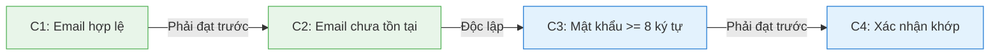
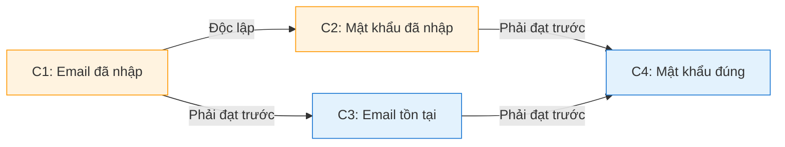
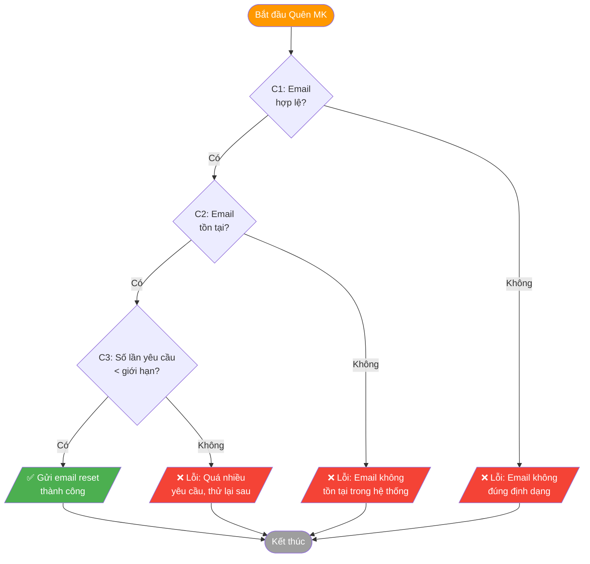
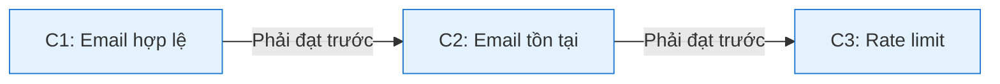
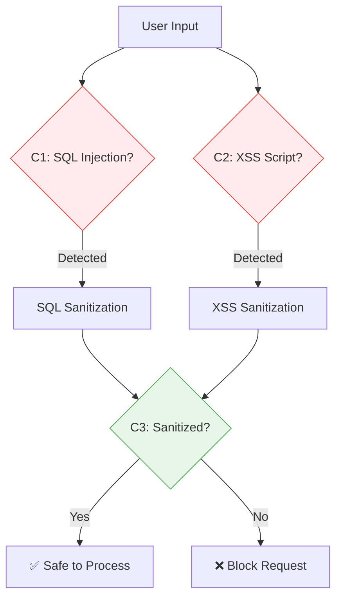

\# BẢNG QUYẾT ĐỊNH (DECISION TABLE)

## Mục đích

Bảng quyết định giúp xác định tất cả các kết hợp điều kiện đầu vào và kết quả tương ứng, đảm bảo coverage đầy đủ cho testing.

---

## 1. Bảng quyết định - Đăng ký (Registration)

### Biểu đồ luồng quyết định

### Điều kiện đầu vào

| Điều kiện | Mô tả | Chi tiết | Giá trị hợp lệ | Giá trị không hợp lệ |
|-----------|-------|----------|----------------|----------------------|
| C1 | Email hợp lệ | Kiểm tra định dạng email theo RFC 5322, phải có `@` và domain | `user@gmail.com`, `test.user@mail.vn` | `invalid`, `@domain.com`, `user@`, `user@@gmail.com` |
| C2 | Email chưa tồn tại | Query database kiểm tra email chưa được đăng ký | Email mới chưa có trong DB | Email đã tồn tại trong DB |
| C3 | Mật khẩu >= 8 ký tự | Kiểm tra độ dài chuỗi password >= 8 | `password123`, `MyP@ss2024` | `pass`, `1234567`, `` (rỗng) |
| C4 | Xác nhận mật khẩu khớp | So sánh string password == confirm_password | Hai trường nhập giống nhau | Hai trường nhập khác nhau |

### Mối quan hệ giữa các biến

> **Ghi chú**: C1→C2 là chuỗi kiểm tra email, C3→C4 là chuỗi kiểm tra mật khẩu. Hai chuỗi này có thể kiểm tra song song.

### Bảng quyết định

| Rule | R1 | R2 | R3 | R4 | R5 | R6 | R7 | R8 |
|------|----|----|----|----|----|----|----|----|
| **Điều kiện** | | | | | | | | |
| C1: Email hợp lệ | T | T | T | T | T | T | F | F |
| C2: Email chưa tồn tại | T | T | T | T | F | F | - | - |
| C3: Mật khẩu >= 8 ký tự | T | T | F | F | - | - | - | - |
| C4: Xác nhận mật khẩu khớp | T | F | - | - | - | - | - | - |
| **Hành động** | | | | | | | | |
| Đăng ký thành công | ✓ | | | | | | | |
| Lỗi: "Mật khẩu không khớp" | | ✓ | | | | | | |
| Lỗi: "Mật khẩu tối thiểu 8 ký tự" | | | ✓ | ✓ | | | | |
| Lỗi: "Email đã được sử dụng" | | | | | ✓ | ✓ | | |
| Lỗi: "Email không đúng định dạng" | | | | | | | ✓ | ✓ |

### Mapping với Test Cases

| Rule | Test Case ID |
|------|--------------|
| R1 | TC_AUTH_001, TC_AUTH_005 |
| R2 | TC_AUTH_015 |
| R3, R4 | TC_AUTH_004 |
| R5, R6 | TC_AUTH_002 |
| R7, R8 | TC_AUTH_003 |

---

## 2. Bảng quyết định - Đăng nhập (Login)

### Biểu đồ luồng quyết định

### Điều kiện đầu vào

| Điều kiện | Mô tả | Chi tiết | Giá trị hợp lệ | Giá trị không hợp lệ |
|-----------|-------|----------|----------------|----------------------|
| C1 | Email đã nhập | Kiểm tra trường email không rỗng và không chỉ có whitespace | `user@gmail.com`, bất kỳ chuỗi không rỗng | `` (rỗng), `   ` (chỉ whitespace) |
| C2 | Mật khẩu đã nhập | Kiểm tra trường password không rỗng | Bất kỳ chuỗi không rỗng | `` (rỗng) |
| C3 | Email tồn tại | Query database kiểm tra email đã đăng ký | Email có trong bảng users | Email không có trong DB |
| C4 | Mật khẩu đúng | Hash password nhập vào và so sánh với hash trong DB | Hash khớp với DB | Hash không khớp |

### Mối quan hệ giữa các biến

> **Ghi chú**: C1 và C2 kiểm tra input cơ bản (độc lập). C3 và C4 kiểm tra logic nghiệp vụ (phụ thuộc tuần tự).

### Bảng quyết định

| Rule | R1 | R2 | R3 | R4 | R5 | R6 |
|------|----|----|----|----|----|----|
| **Điều kiện** | | | | | | |
| C1: Email đã nhập | T | T | T | T | F | T |
| C2: Mật khẩu đã nhập | T | T | T | T | T | F |
| C3: Email tồn tại | T | T | F | F | - | - |
| C4: Mật khẩu đúng | T | F | - | - | - | - |
| **Hành động** | | | | | | |
| Đăng nhập thành công | ✓ | | | | | |
| Lỗi: "Email/mật khẩu không đúng" | | ✓ | ✓ | ✓ | | |
| Lỗi: "Vui lòng nhập email" | | | | | ✓ | |
| Lỗi: "Vui lòng nhập mật khẩu" | | | | | | ✓ |

### Mapping với Test Cases

| Rule | Test Case ID |
|------|--------------|
| R1 | TC_AUTH_006 |
| R2 | TC_AUTH_007 |
| R3, R4 | TC_AUTH_008 |
| R5 | TC_AUTH_009 |

---

## 3. Bảng quyết định - Quên mật khẩu (Forgot Password)

### Biểu đồ luồng quyết định

### Điều kiện đầu vào

| Điều kiện | Mô tả | Chi tiết | Giá trị hợp lệ | Giá trị không hợp lệ |
|-----------|-------|----------|----------------|----------------------|
| C1 | Email hợp lệ | Kiểm tra định dạng email theo RFC 5322 | `user@domain.com`, `test.user@mail.vn` | `invalid`, `@domain.com`, `user@` |
| C2 | Email tồn tại | Kiểm tra email đã đăng ký trong database | Email đã đăng ký tài khoản | Email chưa từng đăng ký |
| C3 | Giới hạn yêu cầu | Số lần request reset trong 24h < 5 lần | 0-4 lần yêu cầu | >= 5 lần yêu cầu |

### Mối quan hệ giữa các biến

> **Ghi chú**: Các điều kiện có quan hệ phụ thuộc tuần tự. C2 chỉ được kiểm tra khi C1=True, C3 chỉ được kiểm tra khi C2=True.

### Bảng quyết định

| Rule | R1 | R2 | R3 | R4 | R5 | R6 |
|------|----|----|----|----|----|----|
| **Điều kiện** | | | | | | |
| C1: Email hợp lệ | T | T | T | T | F | F |
| C2: Email tồn tại | T | T | F | F | - | - |
| C3: Số lần < 5 | T | F | - | - | - | - |
| **Hành động** | | | | | | |
| Gửi email reset thành công | ✓ | | | | | |
| Lỗi: "Quá nhiều yêu cầu" | | ✓ | | | | |
| Lỗi: "Email không tồn tại" | | | ✓ | ✓ | | |
| Lỗi: "Email không đúng định dạng" | | | | | ✓ | ✓ |

### Mapping với Test Cases

| Rule | Test Case ID | Mô tả |
|------|--------------|-------|
| R1 | TC_AUTH_010 | Reset mật khẩu thành công |
| R2 | TC_AUTH_016 | Vượt quá giới hạn yêu cầu |
| R3, R4 | TC_AUTH_011 | Email không tồn tại |
| R5, R6 | TC_AUTH_017 | Email không đúng định dạng |

---

## 4. Bảng quyết định - Security Testing

### Biểu đồ luồng quyết định

### Điều kiện đầu vào

| Điều kiện | Mô tả | Chi tiết | Giá trị hợp lệ (Có tấn công) | Giá trị không hợp lệ (Không tấn công) |
|-----------|-------|----------|------------------------------|--------------------------------------|
| C1 | SQL Injection | Input chứa các SQL keywords như `SELECT`, `DROP`, `OR 1=1`, `--` comment | `' OR 1=1 --`, `'; DROP TABLE users;--`, `admin'--` | `normaluser`, `john.doe@email.com` |
| C2 | XSS Script | Input chứa JavaScript code hoặc HTML tags nguy hiểm | ``, ``, `javascript:void(0)` | `Hello World`, `<b>Bold text</b>` |
| C3 | Đã Sanitize | Hệ thống xử lý escape/encode input trước khi sử dụng | Input đã được làm sạch | Input chưa xử lý (raw) |

### Mối quan hệ giữa các biến

> **Ghi chú**: C1 và C2 là kiểm tra độc lập (OR logic). C3 là kết quả của quá trình sanitization, phụ thuộc vào việc phát hiện C1 hoặc C2.

### Bảng quyết định

| Rule | R1 | R2 | R3 | R4 |
|------|----|----|----|----|
| **Điều kiện** | | | | |
| C1: SQL Injection | T | F | T | F |
| C2: XSS script | F | T | T | F |
| C3: Được sanitize | T | T | T | T |
| **Hành động** | | | | |
| Hiển thị lỗi validation | ✓ | ✓ | ✓ | |
| Script không thực thi | ✓ | ✓ | ✓ | ✓ |
| Không lỗi hệ thống | ✓ | ✓ | ✓ | ✓ |

### Mapping với Test Cases

| Rule | Test Case ID |
|------|--------------|
| R1 | TC_AUTH_013 |
| R2 | TC_AUTH_014 |

---

## Ghi chú

| Ký hiệu | Ý nghĩa |
|---------|---------|
| T | True - Điều kiện đúng |
| F | False - Điều kiện sai |
| - | Don't Care - Không ảnh hưởng |
| ✓ | Hành động được thực hiện |
| (trống) | Hành động không thực hiện |

---

## Tổng kết

| Chức năng | Số biến đầu vào | Số Rules | Test Cases Ánh xạ |
|-----------|-----------------|----------|-------------------|
| Đăng ký | 4 | 8 | 5 TCs |
| Đăng nhập | 4 | 6 | 4 TCs |
| Quên mật khẩu | 3 | 6 | 4 TCs |
| Security | 3 | 4 | 2 TCs |
| **Tổng** | **14** | **24** | **15 TCs** |
